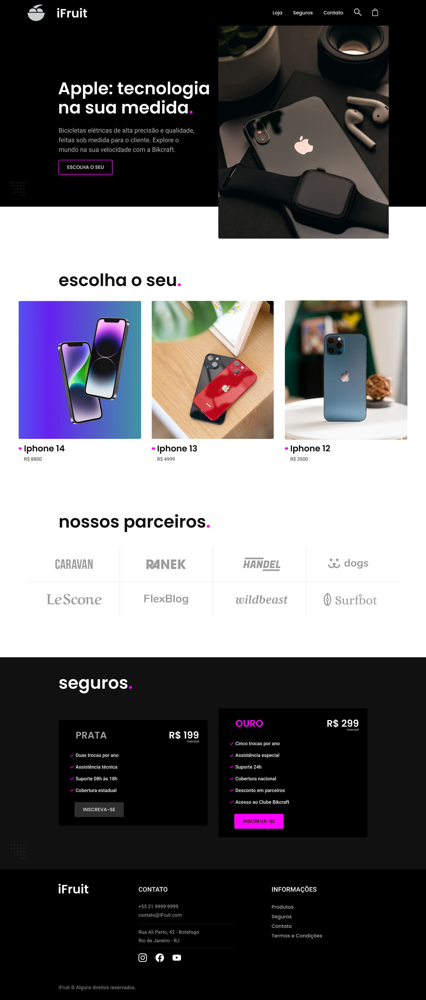
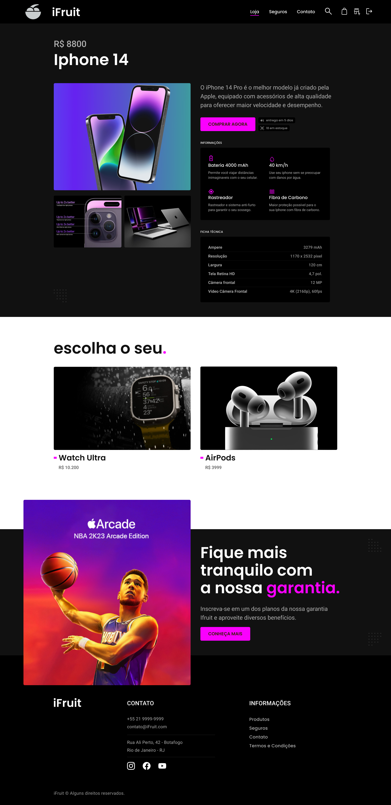

# E-commerce ifruit 

 
  <h1> Home </h1>                                  
  
  

 
  <h1> Produtos </h1>                                  
  
  

 
  <h1> Detalhes do Produto </h1>                                  
  
  

